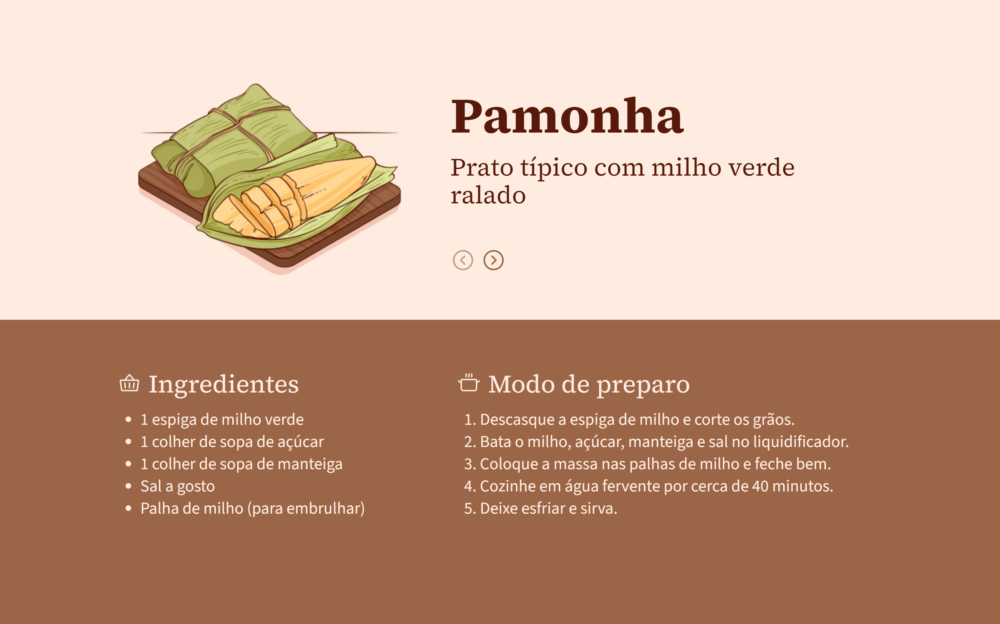

<h1 align="center"> Receitas Juninas - BoraCodar#26 </h1>

[Clique aqui para acessar]()

## 🚀 Tecnologias

Esse projeto foi desenvolvido com as seguintes tecnologias:

- [React.js](https://react.dev/)
- [Tailwind CSS](https://tailwindcss.com/)
- Git and GitHub

## 💻 Projeto

O projeto "Receitas Juninas" mostra comidas típicas das festas juninas, seus ingredientes e como prepará-las. 

Projeto construído a partir do layout proposto no desafio [#BoraCodar26](https://boracodar.dev/) realizado pela [Rocketseat](https://rocketseat.com.br).
Após o desenvolvimento do projeto inicial, adicionei novas features, tais quais:

- Layout responsivo (Adaptado para telas menores);
- Botões para alternar as receitas;
- Mais variedades de comidas típicas;
- Efeito active;
- Entre outras pequenas modificações.

## 🔖 Layout

Você pode visualizar o layout do projeto proposto através [DESSE LINK](https://www.figma.com/community/file/1255887923488942888). É necessário ter conta no [Figma](https://figma.com) para acessá-lo.